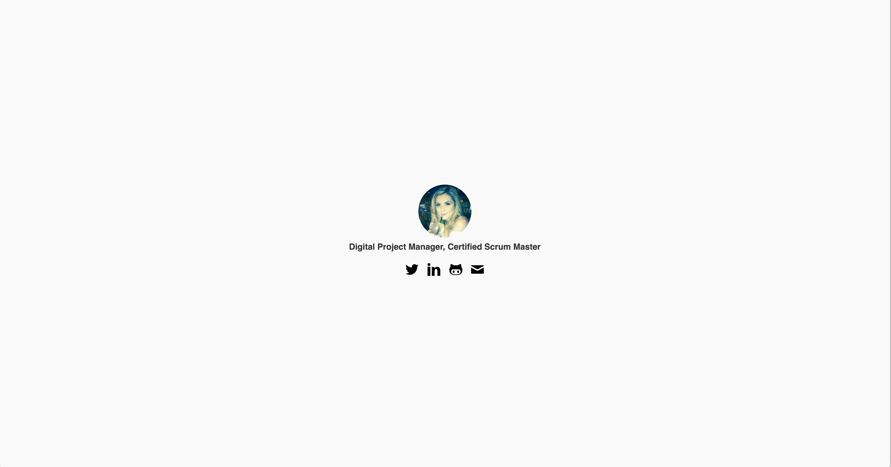

# gilliansibthorpe.com

* [Introduction](#introduction)
* [Setup](#setup)
* [Running](#running)
* [Screenshot](#screenshot)

## Introduction

It's just Gill's personal website, hosted on github pages which I moved into jekyll so she can mess around with markdown and other cool stuff.

## Setup

If there's a lockfile, probably delete it or it'll give you some version issues, I forced 2.2.2 locally with rbenv and then commited it, this should probably be corrected and .ruby-version removed from the .gitignore but i'm lazy.

```
bundle install
```

Then it'll install some stuff!

## Running

```
bundle exec jekyll serve
```

Visit http://127.0.0.1:4000 and you should see your page.

## Screenshot


